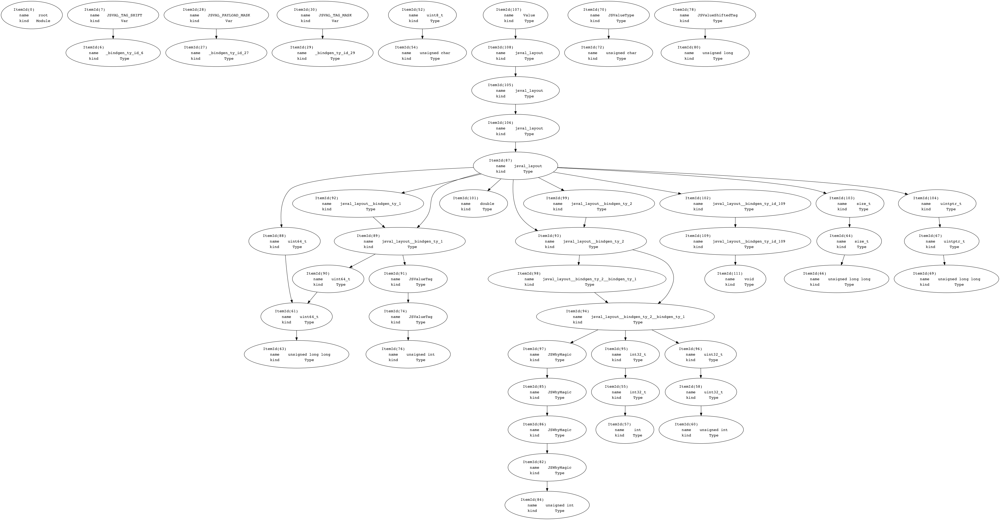

# Contributing to `bindgen`

Hi! We'd love to have your contributions! If you want help or mentorship, reach
out to us in a GitHub issue, or stop by
[#servo on irc.mozilla.org](irc://irc.mozilla.org#servo) and introduce yourself.

<!-- START doctoc generated TOC please keep comment here to allow auto update -->
<!-- DON'T EDIT THIS SECTION, INSTEAD RE-RUN doctoc TO UPDATE -->


- [Code of Conduct](#code-of-conduct)
- [Filing an Issue](#filing-an-issue)
- [Looking to Start Contributing to `bindgen`?](#looking-to-start-contributing-to-bindgen)
- [Building](#building)
- [Testing](#testing)
  - [Overview](#overview)
  - [Testing Bindings Generation](#testing-bindings-generation)
  - [Testing Generated Bindings](#testing-generated-bindings)
  - [Testing a Single Header's Bindings Generation and Compiling its Bindings](#testing-a-single-headers-bindings-generation-and-compiling-its-bindings)
  - [Authoring New Tests](#authoring-new-tests)
  - [Test Expectations and `libclang` Versions](#test-expectations-and-libclang-versions)
  - [Integration Tests](#integration-tests)
  - [Fuzzing `bindgen` with `csmith`](#fuzzing-bindgen-with-csmith)
  - [Property tests for `bindgen` with `quickchecking`](#property-tests-for-bindgen-with-quickchecking)
- [Code Overview](#code-overview)
- [Pull Requests and Code Reviews](#pull-requests-and-code-reviews)
- [Generating Graphviz Dot Files](#generating-graphviz-dot-files)
- [Debug Logging](#debug-logging)
- [Using `creduce` to Minimize Test Cases](#using-creduce-to-minimize-test-cases)
  - [Getting `creduce`](#getting-creduce)
  - [Isolating Your Test Case](#isolating-your-test-case)
  - [Writing a Predicate Script](#writing-a-predicate-script)

<!-- END doctoc generated TOC please keep comment here to allow auto update -->

## Code of Conduct

We abide by the [Rust Code of Conduct][coc] and ask that you do as well.

[coc]: https://www.rust-lang.org/en-US/conduct.html

## Filing an Issue

Think you've found a bug? File an issue! To help us understand and reproduce the
issue, provide us with:

* A (preferably reduced) C/C++ header file that reproduces the issue
* The `bindgen` flags used to reproduce the issue with the header file
* The expected `bindgen` output
* The actual `bindgen` output
* The [debugging logs](#logs) generated when running `bindgen` on this testcase

## Looking to Start Contributing to `bindgen`?

* [Issues labeled "easy"](https://github.com/rust-lang-nursery/rust-bindgen/issues?q=is%3Aopen+is%3Aissue+label%3AE-easy)
* [Issues labeled "less easy"](https://github.com/rust-lang-nursery/rust-bindgen/issues?q=is%3Aopen+is%3Aissue+label%3AE-less-easy)
* [Issues labeled "help wanted"](https://github.com/rust-lang-nursery/rust-bindgen/labels/help%20wanted)
* Still can't find something to work on? [Drop a comment here](https://github.com/rust-lang-nursery/rust-bindgen/issues/747)

## Building

To build the `bindgen` library and the `bindgen` executable:

```
$ cargo build
```

If you installed multiple versions of llvm, it may not be able to locate the
latest version of libclang. In that case, you may want to either uninstall other
versions of llvm, or specify the path of the desired libclang explicitly:

```
$ export LIBCLANG_PATH=path/to/clang-3.9/lib
```

Additionally, you may want to build and test with the `testing_only_docs`
feature to ensure that you aren't forgetting to document types and functions. CI
will catch it if you forget, but the turn around will be a lot slower ;)

```
$ cargo build --features testing_only_docs
```

## Testing

### Overview

Input C/C++ test headers reside in the `tests/headers` directory. Expected
output Rust bindings live in `tests/expectations/tests`. For example,
`tests/headers/my_header.h`'s expected generated Rust bindings would be
`tests/expectations/tests/my_header.rs`.

There are also some integration tests in the `./bindgen-integration` crate, which uses `bindgen` to
generate bindings to some C++ code, and then uses the bindings, asserting that
values are what we expect them to be, both on the Rust and C++ side.

The generated and expected bindings are run through `rustfmt` before they are
compared. Make sure you have `rustfmt` up to date:

```
$ rustup update nightly
$ rustup run nightly cargo install -f rustfmt-nightly
```

Note: running `cargo test` from the root directory of `bindgen`'s repository does not
automatically test the generated bindings or run the integration tests.
These steps must be performed manually when needed.

### Testing Bindings Generation

To regenerate bindings from the corpus of test headers in `tests/headers` and
compare them against the expected bindings in `tests/expectations/tests`, run:

```
$ cargo test
```

As long as you aren't making any changes to `bindgen`'s output, running this
should be sufficient to test your local modifications.

### Testing Generated Bindings

If your local changes are introducing expected modifications in the
`tests/expectations/tests/*` bindings files, then you should test that the
generated bindings files still compile, and that their struct layout tests still
pass. Also, run the integration tests (see below).

You can do this with these commands:

```
$ cd tests/expectations
$ cargo test
```

### Testing a Single Header's Bindings Generation and Compiling its Bindings

Sometimes its useful to work with one test header from start (generating
bindings for it) to finish (compiling the bindings and running their layout
tests). This can be done with the `tests/test-one.sh` script. It supports fuzzy
searching for test headers. For example, to test
`tests/headers/what_is_going_on.hpp`, execute this command:

```
$ ./tests/test-one.sh going
```

Note that `test-one.sh` does not recompile `bindgen`, so if you change the code,
you'll need to rebuild it before running the script again.

### Authoring New Tests

To add a new test header to the suite, simply put it in the `tests/headers`
directory. Next, run `bindgen` to generate the initial expected output Rust
bindings. Put those in `tests/expectations/tests`.

If your new test requires certain flags to be passed to `bindgen`, you can
specify them at the top of the test header, with a comment like this:

`new_test_header.hpp`:

```c
// bindgen-flags: --enable-cxx-namespaces -- -std=c++14
```

Then verify the new Rust bindings compile and pass their layout tests:

```
$ cd tests/expectations
$ cargo test new_test_header
```

### Test Expectations and `libclang` Versions

If a test generates different bindings across different `libclang` versions (for
example, because we take advantage of better/newer APIs when possible), then you
can add multiple test expectations, one for each supported `libclang`
version. Instead of having a single `tests/expectations/tests/my_test.rs` file,
add each of:

* `tests/expectations/tests/libclang-4/my_test.rs`
* `tests/expectations/tests/libclang-3.9/my_test.rs`
* `tests/expectations/tests/libclang-3.8/my_test.rs`

If you need to update the test expectations for a test file that generates
different bindings for different `libclang` versions, you *don't* need to have
many version of `libclang` installed locally. Just make a work-in-progress pull
request, and then when Travis CI fails, it will log a diff of the
expectations. Use the diff to patch the appropriate expectation file locally and
then update your pull request.

Usually, `bindgen`'s test runner can infer which version of `libclang` you
have. If for some reason it can't, you can force a specific `libclang` version
to check the bindings against with a cargo feature:

```
$ cargo test --features testing_only_libclang_$VERSION
```

Where `$VERSION` is one of:

* `4`
* `3_9`
* `3_8`

depending on which version of `libclang` you have installed.

### Integration Tests

The `./bindgen-integration` crate uses `bindgen` to
generate bindings to some C++ code, and then uses the bindings, asserting that
values are what we expect them to be, both on the Rust and C++ side.

To run the integration tests, issue the following:

```
$ cd bindgen-integration
$ cargo test
```

### Fuzzing `bindgen` with `csmith`

We <3 finding hidden bugs and the people who help us find them! One way to help
uncover hidden bugs is by running `csmith` to generate random headers to test
`bindgen` against.

See [./csmith-fuzzing/README.md](./csmith-fuzzing/README.md) for details.

### Property tests for `bindgen` with `quickchecking`

The `tests/quickchecking` crate generates property tests for `bindgen`.
From the crate's directory you can run the tests with `cargo run`. For details
on additional configuration including how to preserve / inspect the generated 
property tests, see 
[./tests/quickchecking/README.md](./tests/quickchecking/README.md).

## Code Overview

`bindgen` takes C and C++ header files as input and generates corresponding Rust
`#[repr(C)]` type definitions and `extern` foreign function declarations.

First, we use `libclang` to parse the input headers. See `src/clang.rs` for our
Rust-y wrappers over the raw C `libclang` API that the `clang-sys` crate
exposes. We walk over `libclang`'s AST and construct our own internal
representation (IR).  The `ir` module and submodules (`src/ir/*`) contain the IR
type definitions and `libclang` AST into IR parsing code.

The umbrella IR type is the `Item`. It contains various nested `enum`s that let
us drill down and get more specific about the kind of construct that we're
looking at. Here is a summary of the IR types and their relationships:

* `Item` contains:
    * An `ItemId` to uniquely identify it.
    * An `ItemKind`, which is one of:
        * A `Module`, which is originally a C++ namespace and becomes a Rust
          module. It contains the set of `ItemId`s of `Item`s that are defined
          within it.
        * A `Type`, which contains:
            * A `Layout`, describing the type's size and alignment.
            * A `TypeKind`, which is one of:
                * Some integer type.
                * Some float type.
                * A `Pointer` to another type.
                * A function pointer type, with `ItemId`s of its parameter types
                  and return type.
                * An `Alias` to another type (`typedef` or `using X = ...`).
                * A fixed size `Array` of `n` elements of another type.
                * A `Comp` compound type, which is either a `struct`, `class`,
                  or `union`. This is potentially a template definition.
                * A `TemplateInstantiation` referencing some template definition
                  and a set of template argument types.
                * Etc...
        * A `Function`, which contains:
            * An ABI
            * A mangled name
            * a `FunctionKind`, which describes whether this function is a plain
              function, method, static method, constructor, destructor, etc.
            * The `ItemId` of its function pointer type.
        * A `Var` representing a static variable or `#define` constant, which
          contains:
            * Its type's `ItemId`
            * Optionally, a mangled name
            * Optionally, a value

The IR forms a graph of interconnected and inter-referencing types and
functions. The `ir::traversal` module provides IR graph traversal
infrastructure: edge kind definitions (base member vs field type vs function
parameter, etc...), the `Trace` trait to enumerate an IR thing's outgoing edges,
various traversal types.

After constructing the IR, we run a series of analyses on it. These analyses do
everything from allocate logical bitfields into physical units, compute for
which types we can `#[derive(Debug)]`, to determining which implicit template
parameters a given type uses. The analyses are defined in
`src/ir/analysis/*`. They are implemented as fixed-point algorithms, using the
`ir::analysis::MonotoneFramework` trait.

The final phase is generating Rust source text from the analyzed IR, and it is
defined in `src/codegen/*`. We use the `quote` crate, which provides the `quote!
{ ... }` macro for quasi-quoting Rust forms.

## Pull Requests and Code Reviews

Ensure that each commit stands alone, and passes tests. This enables better `git
bisect`ing when needed. If your commits do not stand on their own, then rebase
them on top of the latest master and squash them into a single commit.

All pull requests undergo code review before merging. To request review, comment
`r? @github_username_of_reviewer`. They we will respond with `r+` to approve the
pull request, or may leave feedback and request changes to the pull request. Any
changes should be squashed into the original commit.

Unsure who to ask for review? Ask any of:

* `@emilio`
* `@fitzgen`
* `@pepyakin`

More resources:

* [Servo's GitHub Workflow](https://github.com/servo/servo/wiki/Github-workflow)
* [Beginner's Guide to Rebasing and Squashing](https://github.com/servo/servo/wiki/Beginner's-guide-to-rebasing-and-squashing)

## Generating Graphviz Dot Files

We can generate [Graphviz](http://graphviz.org/pdf/dotguide.pdf) dot files from
our internal representation of a C/C++ input header, and then you can create a
PNG or PDF from it with Graphviz's `dot` program. This is very useful when
debugging bindgen!

First, make sure you have Graphviz and `dot` installed:

```
$ brew install graphviz         # OS X
$ sudo dnf install graphviz     # Fedora
$ # Etc...
```

Then, use the `--emit-ir-graphviz` flag to generate a `dot` file from our IR:

```
$ cargo run -- example.hpp --emit-ir-graphviz output.dot
```

Finally, convert the `dot` file to an image:

```
$ dot -Tpng output.dot -o output.png
```

The final result will look something like this:

[](./example-graphviz-ir.png)

## Debug Logging

To help debug what `bindgen` is doing, you can define the environment variable
`RUST_LOG=bindgen` to get a bunch of debugging log spew.

```
$ RUST_LOG=bindgen ./target/debug/bindgen [flags...] ~/path/to/some/header.h
```

This logging can also be used when debugging failing tests:

```
$ RUST_LOG=bindgen cargo test
```

## Using `creduce` to Minimize Test Cases

If you find a test case that triggers an unexpected panic in `bindgen`, causes
`bindgen` to emit bindings that won't compile, define structs with the wrong
size/alignment, or results in any other kind of incorrectness, then using
`creduce` can help reduce the test case to a minimal one that still exhibits
that same bad behavior.

***Reduced test cases are SUPER helpful when filing bug reports!***

### Getting `creduce`

Often, you can install `creduce` from your OS's package manager:

```
$ sudo apt install creduce
$ brew install creduce
$ # Etc...
```

[Otherwise, follow these instructions for building and/or installing `creduce`.](https://github.com/csmith-project/creduce/blob/master/INSTALL)

Running `creduce` requires two things:

1. Your isolated test case, and

2. A script to act as a predicate script describing whether the behavior you're
   trying to isolate occurred.

With those two things in hand, running `creduce` looks like this:

    $ creduce ./predicate.sh ./isolated-test-case.h

### Isolating Your Test Case

If you're using `bindgen` as a command line tool, pass
`--dump-preprocessed-input` flag.

If you're using `bindgen` as a Rust library, invoke the
`bindgen::Builder::dump_preprocessed_input` method where you call
`bindgen::Builder::generate`.

Afterwards, there should be a `__bindgen.i` or `__bindgen.ii` file containing
the combined and preprocessed input headers, which is usable as an isolated,
standalone test case.

### Writing a Predicate Script

Writing a `predicate.sh` script for a `bindgen` test case is straightforward. We
already have a general purpose predicate script that you can use, you just have
to wrap and configure it.

```bash
#!/usr/bin/env bash

# Exit the script with a nonzero exit code if:
# * any individual command finishes with a nonzero exit code, or
# * we access any undefined variable.
set -eu

# Invoke the general purpose predicate script that comes in the
# `bindgen` repository.
#
# You'll need to replace `--whatever-flags` with things that are specific to the
# incorrectness you're trying to pin down. See below for details.
path/to/rust-bindgen/csmith-fuzzing/predicate.py \
    --whatever-flags \
    ./isolated-test-case.h
```

When hunting down a particular panic emanating from inside `bindgen`, you can
invoke `predicate.py` like this:

```bash
path/to/rust-bindgen/csmith-fuzzing/predicate.py \
    --expect-bindgen-fail \
    --bindgen-grep "thread main panicked at '<insert panic message here>'" \
    ./isolated-test-case.h
```

Alternatively, when hunting down a bad `#[derive(Eq)]` that is causing `rustc`
to fail to compile `bindgen`'s emitted bindings, you can invoke `predicate.py`
like this:

```bash
path/to/rust-bindgen/csmith-fuzzing/predicate.py \
    --bindings-grep NameOfTheStructThatIsErroneouslyDerivingEq \
    --expect-compile-fail \
    --rustc-grep 'error[E0277]: the trait bound `f64: std::cmp::Eq` is not satisfied' \
    ./isolated-test-case.h
```

Or, when minimizing a failing layout test in the compiled bindings, you can
invoke `predicate.py` like this:

```bash
path/to/rust-bindgen/csmith-fuzzing/predicate.py \
    --bindings-grep MyStruct \
    --expect-layout-tests-fail \
    --layout-tests-grep "thread 'bindgen_test_layout_MyStruct' panicked" \
    ./isolated-test-case.h
```

For details on all the flags that you can pass to `predicate.py`, run:

```
$ path/to/rust-bindgen/csmith-fuzzing/predicate.py --help
```

And you can always write your own, arbitrary predicate script if you prefer.
(Although, maybe we should add extra functionality to `predicate.py` -- file an
issue if you think so!)

`creduce` is *really* helpful and can cut hundreds of thousands of lines of test
case down to 5 lines.

Happy bug hunting and test case reducing!

[More information on using `creduce`.](https://embed.cs.utah.edu/creduce/using/)
